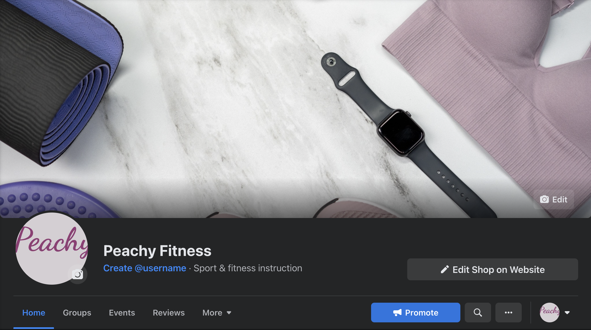
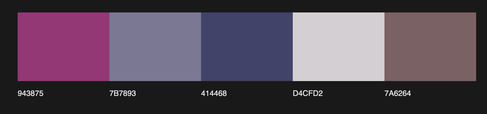

# Peachy Fitness

insert pic and deployed site links/github

## Table of contents
1. [Introduction](#Introduction)
2. [UX](#UX)
    1. [Ideal User Demographic](#Ideal-User-Demographic)
    2. [User Stories](#User-Stories)
    3. [Development Planes](#Development-Planes)
    4. [Design](#Design)
3. [Features](#Features)
    1. [Design Features](#Design-Features) 
    2. [Existing Features](#Existing-Features)
    3. [Features to Implement in the future](#Features-to-Implement-in-the-future)
4. [Issues and Bugs](#Issues-and-Bugs)
5. [Technologies Used](#Technologies-Used)
     1. [Main Languages Used](#Main-Languages-Used)
     2. [Additional Languages Used](#Additional-Languages-Used)
     3. [Frameworks, Libraries & Programs Used](#Frameworks,-Libraries-&-Programs-Used)
6. [Testing](#Testing)
     1. [Testing.md](TESTING.md)
7. [Deployment](#Deployment)
     1. [Deploying on Heroku](#Deploying-on-Heroku)
     2. [Forking the Repository](#Forking-the-Repository)
     3. [Creating a Clone](#Creating-a-Clone)
8. [Credits](#Credits)
     1. [Content](#Content)
     2. [static/Media](#static/Media)
     3. [Code](#Code)
9. [Acknowledgements](#Acknowledgements)

## Introduction

Peachy Fitness seeks to empower women and get them more into fitness. The site offers all that a person could need starting out on their fitness journey.

[Back to top ⇧](#)

## UX 
### Ideal User Demographic
The ideal user of this website is:
- Women/girls from ages 14 - 40
- Fashion-conscious people
- Motivated people

### User Stories

### Development Planes
To prepare for this project, I researched other fitness brand websites. This preparation helped me create the user stories. Some of the websites I used were:
- [Gymshark](https://eu.gymshark.com/)
- [Gym plus Coffee](https://gympluscoffee.com/)
- [Shreddy](https://shreddy.com/)

#### Strategy
With this website, I concentrated on the following aspects:
- Roles
    - Site User
    - Site Owner
- Demographic
    - Women/girls around 14-40
    - Fitness enthusiasts
- Psychographics
    - Personality & Attitudes:
        - Playful
        - Sporty
        - Outgoing
        - Motivated

    - Values:
        - Has a growth mindset
        - Positive
        - Fashionable

    - Lifestyles:
        - Has friends who have similar interests such as hiking or other outdoor activities
        - Keeps up with the latest trends
        - Likes trying out different things like Irish dancing or painting etc
        - Likes to look good

I found that the website needs to enable the **Site User** to:
- Find attractive and high quality exercise products for women in all sizes.
- Add the desired products to the shopping bag for purchasing.
- Filter the products based on name, categories, rating and prices.
- Search products by name or description.
- Create a profile with the saved user info and past orders.

The website needs to enable the **Site Owner** to:
- Add, edit and delete products on the site.
- View orders on the admin panel.

##### **eCommerce Application Type and Marketing Strategy**
To create a site that fit the user's needs, I planned the following marketing strategy:

- **eCommerce Type:**
    - **B2C** - I used SEO (Search Engine Optimisation), Content Marketing in the form of a newsletter, and Social Media Marketing in the form of a Facebook and Instagram page.

- Marketing Types:
    - **SEO** - SEO is useful for ensuring a good online presence. It is important to be present in the digital landscape as this form is everywhere around us and an important platform for a business. SEO must be carefully managed to not be treated as spam. I tried to avoid spaming the page content with words. I made sure to fill the meta tag with valuable keywords and a useful description.

    - **Content Marketing** - I used a newsletter. This marketing can help keep the business stay in the mind of the customer and convey a personality to them also. It allows the store to talk about what they are most knowledgable about and as a result build confidence in the users reading the content.

    - **Social Media Marketing** - I used Organic Social Media Marketing. It is a free and easy way to get a brand across. The site can be shared with others and special events or sales can be shared free of charge. This allows the store to connect directly with the consumer and build relationships and loyalty with the customers. This form of marketing can also be used to improve the store's customer service and support. Issues can be dealt with publically in a friendly or even funny way. The social media chosen for this project was [Facebook](https://www.facebook.com/Peachy-Fitness-104511555665795).



### **Scope**
I defined a scope to identify what needed to be done to align features with the strategy previously defined. This was broken into two categories:

- **Content Requirements**
    - The user will be looking for:
        - A variety of products to choose from that come under fitness goals
        - Details of the products provided
        - A way to search the site using the name or description fields
        - A filtering function by rating, name, price and category
        - A  Profile Page displaying the user's saved address and past order
- **Functionality Requirements**
    - The user will be able to:
        - Select their desired size for each product
        - Update their profile with with a address
        - Easily navigate the site to find product information

#### **Structure**
The website was organized in a hierarchical tree structure to ensure that users could navigate through the site with easily.

#### **Skeleton**
I created the Wireframe mockups using [Balsamiq](https://balsamiq.com/). Please find the file below:
- [Wireframes](media/README/wireframes)

[Back to top ⇧](#)

### Design
#### **Colour Scheme**
The colour scheme was influenced by the home page photo. The purple and pink are fun playful colours. A very faint purple was used as a contrast to the deeper purple and pink.



#### **Typography**
The font chosen for the headings was Dancing Script. All the other test was done in Mulish. The Dancing Script was used as the logo. It is fun and elegant. Mulish is very modern and trendy. It is easy to read.

#### **Imagery**
The imagery used in this site is entirely related to the products being sold - exercise goods.

[Back to top ⇧](#)

## Features
## Design Features
**Navigation & Header**

Each page of the website features a consistent responsive navigational system:
- **Logo** - The Logo heading is linked to the home page, clicking it will bring the user back to the home page.
- **Search Bar** - The search bar is coded to display the results of the user's search request.
- **Shopping Bag Icons** - There is an icon and a link to the shopping bag showing the current bag total. The icon's dropdown selection is updated depending on whether the user is logged in or logged out.
- **Link to user's profile** - There is a link to the user's profile depending on if they are linked in or not.
- **Links to Category Pages** - There are links to several categories of product pages. These pages show products of certain categories grouped by different categories such as leggings and sports_bras.

**Footer**
Each page of the website features a consistent responsive footer design:
- **A 'Stay in touch' Piece Of Text** - The footer displays a text asking the users to stay in touch.
- **Social Media Links** - These links connect the site user to the store's business Facebook page.
- **Subscribe to newsletter** - Mailchimp form is present in the footer.

**Home Page**
The home page is the main entry page to the site and gives the customer a call to action straight away. The purpose of the site is clear.
- **Main Image** - This feature is an image underneath the navigation bar and Custom Orders message bar. The image displayed is of some fitness products on the floor. It is not too overwhelming an image.
- **Call to action button** - A call to action button urges the user to shop now.

**Products Page**
This page displays a list of all products. The user can use filters and search queries to filter the list to their desired results.
- **Product Category Links** - There are set of button links that filter the list of products to the selected category.
- **Products Home Link** - There is a link to bring the user back to the 'Products Home', this will display all products rather than filtering by category or search queries.
- **Search Results/Product Counters** - Right next to the link to the 'Products Home' is a counter that tells the user how many products are displayed on the page. If the user has entered a search query, the counter will advise how many products were found for that specific search query.
- **Sort By Selector** -This selector allows the user to order the products displayed by name, rating, price and category in both ascending and descending orders.
- **Product Cards** - The product cards display the products listed on the site and also show some more information about the product such as the rating and price.

## Issues and Bugs 

## Technologies Used
### Main Languages Used
-[Python](https://en.wikipedia.org/wiki/Python_(programming_language))
-[JavaScript](https://en.wikipedia.org/wiki/JavaScript)
-[CSS](https://en.wikipedia.org/wiki/CSS)
-[HTML](https://en.wikipedia.org/wiki/HTML)

### Frameworks, Libraries, Programs and Additional Languages Used
- [Django](https://en.wikipedia.org/wiki/Django_(web_framework))
    - Used to build the pages used in the site and the working of the website.

- [Bootstrap](https://en.wikipedia.org/wiki/Bootstrap_(front-end_framework))
    - Used to add styling to the website.

- [GitPod](https://gitpod.io/)
    - Used for the IDE.

- [GitHub](https://github.com/)
    - Used for version control.

- [Heroku](https://heroku.com/)
    - Used for the deployment of the website.

- [AWS](https://aws.amazon.com/)
    - Used to host MEDIA and STATIC files for the deployed site.

- [django-allauth](https://django-allauth.readthedocs.io/en/latest/)
    - Used for the site's authentication system.

- [AmIResponsive](https://ui.dev/amiresponsive "AmIResponsive Site")
    - Used to generate mockup imagery of the finished website.

[Back to top ⇧](#)

## Testing

## Deployment 
For the project, I used the [GitPod](https://gitpod.io/ "GitPod Site") cloud development IDE. I committed the code to Git and then pushed to [GitHub](https://github.com/ "GitHub Site") using the terminal. After, I deployed to code to [Heroku](https://heroku.com/ "Heroku Site").

### Deploying on Heroku
To deploy this page to Heroku from its GitHub repository, the following steps were taken:

1. Create the Heroku App:
    - Select "Create new app" in Heroku.
    - Choose a name for your app and select the location.

2. Attach the Postgres database:
    - In the Resources tab, under add-ons, type in Postgres and select the Heroku Postgres option.

3. Prepare the environment and settings.py file:
    - In the Settings tab, click on Reveal Config Vars and copy the URL next to DATABASE_URL.
    - In your GitPod workspace, create an env.py file in the main directory. 
    - Add the DATABASE_URL value and your chosen SECRET_KEY value to the env.py file.
    - Add the SECRET_KEY value to the Config Vars in Heroku.
    - Update the settings.py file to import the env file and add the SECRETKEY and DATABASE_URL file paths.
    - Update the Config Vars with the Cloudinary URL, adding into the settings.py file also.
    - In settings.py add the following sections:
        - STATIC_URL
        - STATICFILES_DIRS
        - MEDIA_URL
        - MEDIA_ROOT
        - TEMPLATES_DIR
        - Update DIRS in TEMPLATES with TEMPLATES_DIR
        - Update ALLOWED_HOSTS with ['app_name.herokuapp.com', 'localhost']

4. Set DISABLE_COLLECTSTATIC and Deploy to Heroku:
    - Create three directories in the main directory; media, storage and templates.
    - Create a file named "Procfile" in the main directory and add the following:
        - web: gunicorn project-name.wsgi
    - in the terminal, log in to Heroku and then enter the following:
        - heroku config:set DISABLE_COLLECTSTATIC=1 --app (Heroku App Name)
    - Go to the 'Deploy' tab on Heroku and connect to GitHub, then to the required repository.
    Click on 'Deploy Branch' and wait for the build to load. When the build is complete, the app can be opened through Heroku. 

### Forking the Repository
By forking the GitHub Repository, we make a copy of the original repository on our GitHub account to view and/or make changes without affecting the original repository by using the following steps:

1. Log into [GitHub](https://github.com/login "Link to GitHub login page") or [create an account](https://github.com/join "Link to GitHub create account page").
2. Locate the [GitHub Repository](https://github.com/rebeccatraceyt/KryanLive "Link to GitHub Repo").
3. At the top of the repository, on the right side of the page, select "Fork"
4. You should now have a copy of the original repository in your GitHub account.

### Creating a Clone
How to run this project locally:
1. Install the [GitPod Browser](https://www.gitpod.io/docs/browser-extension/ "Link to Gitpod Browser extension download") Extension for Chrome.
2. After installation, restart the browser.
3. Log into [GitHub](https://github.com/login "Link to GitHub login page") or [create an account](https://github.com/join "Link to GitHub create account page").
2. Locate the [GitHub Repository](https://github.com/rebeccatraceyt/KryanLive "Link to GitHub Repo").
5. Click the green "GitPod" button in the top right corner of the repository.
This will trigger a new GitPod workspace to be created from the code in GitHub where you can work locally.

How to run this project within a local IDE, such as VSCode:

1. Log into [GitHub](https://github.com/login "Link to GitHub login page") or [create an account](https://github.com/join "Link to GitHub create account page").
2. Locate the [GitHub Repository](repo URL "Link to GitHub Repo").
3. Under the repository name, click "Clone or download".
4. In the Clone with HTTPs section, copy the clone URL for the repository.
5. In your local IDE open the terminal.
6. Change the current working directory to the location where you want the cloned directory to be made.
7. Type 'git clone', and then paste the URL you copied in Step 3.

```
git clone https://github.com/USERNAME/REPOSITORY
```

8. Press Enter. Your local clone will be created.

Further reading and troubleshooting on cloning a repository from GitHub [here](https://docs.github.com/en/free-pro-team@latest/github/creating-cloning-and-archiving-repositories/cloning-a-repository "Link to GitHub troubleshooting")

[Back to top ⇧](#)

## Credits 

## Acknowledgements 

- Thank you to my wonderful family for always supporting me
- Thank you to Hassan for always listening to me, encouraging, supporting me and giving me his opinion when I need it


